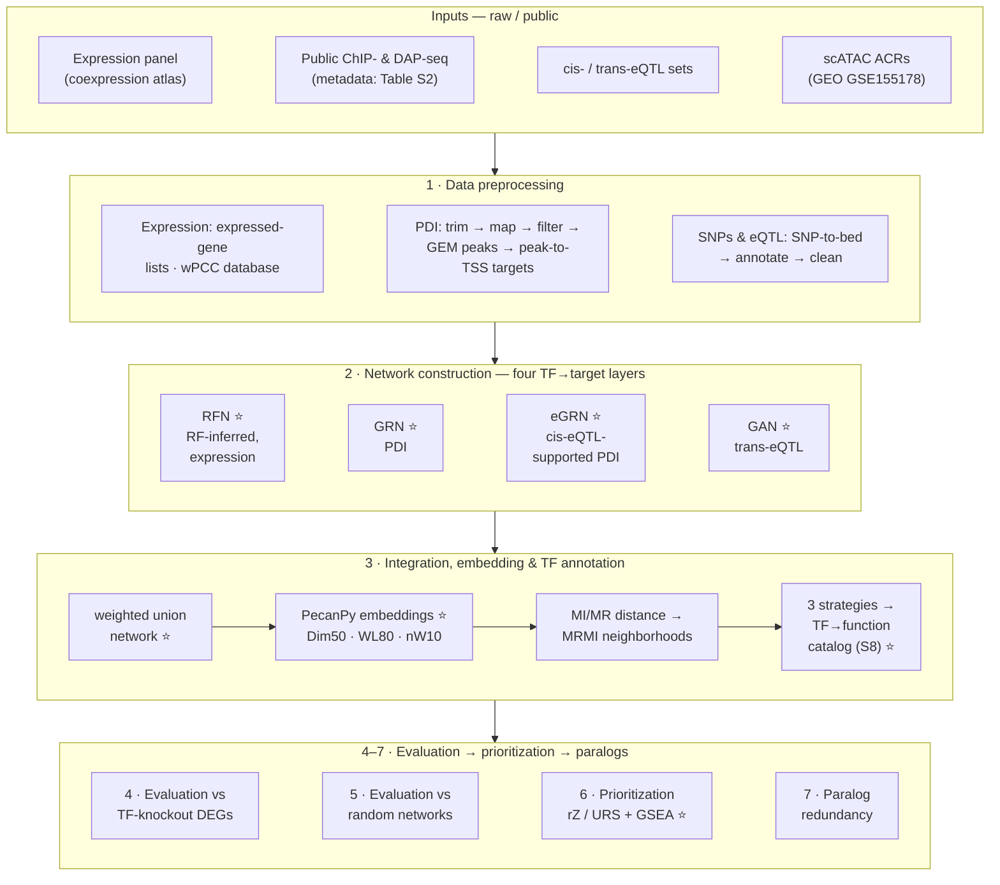

# Multi-Omic Network Integration in Maize

 

Code and processed-data description for **"Prioritizing Maize Metabolic Gene Regulators through Multi-Omic Network Integration"** (Gomez-Cano et al.).

Four transcription-factor (TF)→target network layers are built from maize expression, protein–DNA-interaction (PDI), and eQTL data, then integrated into a single weighted network whose node embeddings are used to annotate, evaluate, prioritize, and compare metabolic gene regulators.

- **Paper:** _[journal / DOI — pending]_
- **Processed outputs** (edge lists, embeddings, TF→function catalog with stability scores, prioritization scores): **Zenodo [10.5281/zenodo.21866340](https://doi.org/10.5281/zenodo.21866340)** — see the [data manifest](#data-artifacts--zenodo-manifest) below
- **License:** MIT (see `LICENSE`)

---

## Pipeline at a glance

Folders `1_ … 7_` are the pipeline, in run order; `8_Revision_analyses/` holds the analyses added in revision. Every artifact marked ⭐ is in the [Zenodo deposit](https://doi.org/10.5281/zenodo.21866340).

*(Band-level arrows; the per-artifact hand-offs are in the tables below.)*

## Step by step

| Step | Folder | What happens | Key outputs (→ used by) | Manuscript |
|---|---|---|---|---|
| **1** | [`1_Data_preprocessing/`](1_Data_preprocessing) | Modality-specific input prep: full raw ChIP-/DAP-seq chain (download → trim → Bowtie2 → MAPQ30+dedup → GEM peaks → peak→TSS targets), eQTL cleaning/annotation, expressed-gene lists + weighted-PCC (wPCC) database | `Net.Dis2TSS.txt`, clean cis/trans eQTL sets, expressed-gene lists, wPCC DB (→ 2, 3) | Methods |
| **2** | [`2_Network_construction/`](2_Network_construction) | One script per layer builds the four TF→target edge lists | `CoExp_NetworkFinal…txt` ⭐, `Only_PDI_NetworkFinal…txt` ⭐, `CisE_PDI_NetworkFinal…txt` ⭐, `teQTL_NetworkFinal…txt` ⭐ (→ 3, 5, 6) | Fig 1 |
| **3** | [`3_Functional_annotation/`](3_Functional_annotation) | Integrate the four layers, embed nodes with PecanPy, group genes by MRMI-neighborhood similarity, annotate TFs by three strategies | `uniqFullNets_weighted.txt` ⭐, PecanPy embeddings ⭐, cluster memberships, PWY/GO enrichments → **TF→function catalog (Table S8)** ⭐ (→ 4, 5, 6) | Figs 1, 3 |
| **4** | [`4_Evaluation_knockouts/`](4_Evaluation_knockouts) | Benchmark the three annotation strategies against TF-knockout DEGs | method-comparison stats; `Summary.Total.Annotation.txt` (→ 6) | Fig 2 |
| **5** | [`5_Evaluation_random_networks/`](5_Evaluation_random_networks) | Rewire networks, re-annotate, compare observed vs random GO recovery | observed-vs-random GO semantic-similarity results | Fig 2 |
| **6** | [`6_Prioritization_and_conditions/`](6_Prioritization_and_conditions) | Rank regulators per process (reciprocal-Z, upstream-regulator score); map TF–GO associations to conditions via GSEA | prioritization scores ⭐, `GSEA_results/` (→ figures) | Figs 3, 4 |
| **7** | [`7_Paralog_redundancy/`](7_Paralog_redundancy) | Predict paralog redundancy/divergence from embedding similarity vs sequence distance | paralog divergence predictions | Fig 5 |
| **8** | [`8_Revision_analyses/`](8_Revision_analyses) | Revision analyses: MRMI-threshold sensitivity, GAN SNP-frequency normalization, paralog null model, Fig 4A tier diagnostics | S8 stability scores, S16 Fig data | Methods, S3 Text |
| — | [`figures/`](figures) | Figure-by-figure map to the scripts that render each panel | — | all |
| — | [`environment/`](environment) | Software & package versions | — | Methods |
| — | `archive/` | Superseded script versions, kept for provenance | — | — |

## From the manuscript to the code

| You are reading… | Go to |
|---|---|
| Fig 1 (networks & integration) | `2_Network_construction/` + `3_Functional_annotation/network_based_embedding/` |
| Fig 2 (benchmarking) | `4_Evaluation_knockouts/` + `5_Evaluation_random_networks/` |
| Fig 3 (prioritization by process) | `6_Prioritization_and_conditions/prioritization_rZ_URS/` |
| Fig 4 (condition mapping) | `6_Prioritization_and_conditions/condition_mapping_GSEA/` |
| Fig 5 (paralogs) | `7_Paralog_redundancy/` |
| Table S2 (ChIP/DAP datasets) | `1_Data_preprocessing/PDI/Table_S2.txt` (input metadata) |
| Table S4 (peak sets / reproducibility) | produced along `1_Data_preprocessing/PDI/` steps 5–7 + `peak_coverage_qc/` |
| Table S8 (TF→function catalog) | produced in `3_Functional_annotation/` (annotation strategies) |
| Methods, preprocessing | `1_Data_preprocessing/` (per-modality READMEs) |
| Methods, network inference | `2_Network_construction/README.md` |
| Methods, embedding & clustering | `3_Functional_annotation/network_based_embedding/` |

A finer per-panel map lives in [`figures/README.md`](figures/README.md).

## Data artifacts — Zenodo manifest

The processed artifacts below are deposited at Zenodo: **DOI [10.5281/zenodo.21866340](https://doi.org/10.5281/zenodo.21866340)** (published 2026-08-10; concept DOI 10.5281/zenodo.21866339). "Born in" = the section whose script writes the file.

| # | Artifact (deposit name) | Content | Born in | Consumed by |
|---|---|---|---|---|
| 1 | `CoExp_NetworkFinal.10_11_2021.txt` | RFN edge list (RF-inferred, expression) | 2 · `RFN_expression/` | 3, 5, 6 |
| 2 | `Only_PDI_NetworkFinal.10_14_2022.txt` | GRN edge list (PDI) | 2 · `GRN_PDI/` | 3, 5, 6 |
| 3 | `CisE_PDI_NetworkFinal.10_14_2022.txt` | eGRN edge list (cis-eQTL-supported PDI) | 2 · `eGRN_cis_eQTL/` | 3, 5, 6 |
| 4 | `teQTL_NetworkFinal.10_11_2021.txt` | GAN edge list (trans-eQTL) | 2 · `GAN_trans_eQTL/` | 3, 5, 6 |
| 5 | `uniqFullNets_weighted.txt` | Integrated weighted union network | 3 · `network_based_embedding/` (`1_Set_Pecanpy_weighted.R`) | PecanPy (step 2) |
| 6 | `Pecanpy_uFNetsW.Dim50_WL80_nW10.txt` | Node embeddings (50 dims, walk length 80, 10 walks) | 3 · `network_based_embedding/` (`2_pecanpy_weighted_job.sh`) | 3 (MI/MR), 7 |
| 7 | TF→function catalog (**Table S8**, `Table_S8.txt`) | TF ↔ predicted pathway/GO functions, all strategies, with per-association threshold-stability scores (see `8_Revision_analyses/`) | 3 · annotation outputs (+ `Summary.Total.Annotation.txt`, assembled in 4) | 6 |
| 8 | Prioritization scores (rZ / URS) | Ranked regulators per metabolic process | 6 · `prioritization_rZ_URS/` | Fig 3 |
| 9 | Repo snapshot | This repository, archived: [10.5281/zenodo.21875975](https://doi.org/10.5281/zenodo.21875975) (v1.0.0) | — | — |

> Items 1–8 are published in the data deposit (the record also carries `Table_S7.txt.gz`, the per-peak PDI table that exceeds journal SI size limits). Item 9 is the code archive, minted on release.

## Reproducing

1. Work through the numbered folders in order; **every section README documents its inputs, scripts in run order, and outputs.**
2. **Path note:** scripts are kept verbatim from the analysis environment for provenance; internal paths still reference the original by-figure working directories (e.g., `../Fig_PDI/`, `Data/Annotations/`). Each section README states which repo folder the old path corresponds to; adjust paths (or symlink) rather than editing scripts.
3. Software versions: [`environment/software_versions.md`](environment/software_versions.md).

### Requirements

- **R** — topGO, GeneOverlap, GOSemSim, Rrvgo, DECIPHER, Parmigene, FGSEA, wCorr, igraph, Rsubread, DESeq2
- **Python** — PecanPy, numpy, pandas, scikit-learn, fcmeans, kneed
- **Command-line** — bcftools, Bowtie2, SAMtools, Picard, Trimmomatic, GEM, bedtools, FastQC, ClusterONE

> **Terminology note:** the expression-based layer built with random-forest regression (following Zhou et al. 2020) is the **RF-inferred regulatory network (RFN)** — previously labeled "co-expression network (CEN)". It predicts regulatory (TF→target) relationships from expression and does not, by itself, imply correlation-based co-expression or causal regulation.

## Citation

If you use this code or the associated data, please cite the manuscript _[citation — pending]_ and the data deposit [10.5281/zenodo.21866340](https://doi.org/10.5281/zenodo.21866340). This repository is archived at [10.5281/zenodo.21875975](https://doi.org/10.5281/zenodo.21875975) (release v1.0.0; concept DOI 10.5281/zenodo.21875974 always resolves to the latest release).
